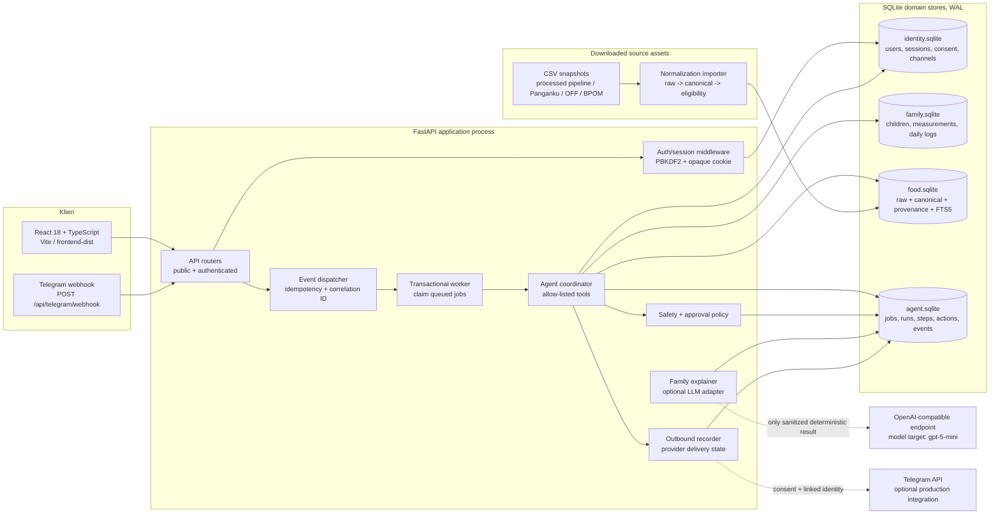
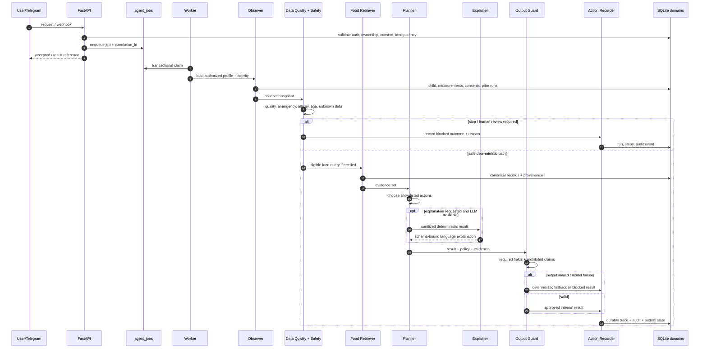

# NutriShield v2 — Arsitektur Teknis

**Status dokumen:** target arsitektur dan kriteria penerimaan untuk prototipe sandbox.

**Audiens:** pemilik produk, engineer backend/frontend, data engineer, reviewer keselamatan, dan operator pilot.

**Dokumen acuan:** spesifikasi implementasi v2 [1] dan audit aset NutriShield [2]. Dokumen ini tidak menyatakan bahwa komponen telah berjalan. Setiap pernyataan tentang kemampuan runtime harus dibuktikan melalui acceptance test, trace, atau artefak deployment yang disebutkan di bagian **Target, bukti, dan acceptance**.

> **Batas produk.** NutriShield ditargetkan sebagai pendamping pencatatan pertumbuhan dan edukasi pangan harian. Sistem bukan alat diagnosis, terapi, pemberian dosis obat atau suplemen, dan bukan pengganti tenaga kesehatan. Ketika data tidak cukup atau risiko melampaui aturan yang tersedia, sistem harus menyatakan ketidakpastian dan mengarahkan pengguna kepada manusia yang tepat.

## 1. Ringkasan keputusan arsitektur

Target v2 adalah satu aplikasi web dengan backend FastAPI, frontend React/TypeScript yang dibangun Vite, SQLite standar dalam mode WAL, dan satu worker proses untuk pekerjaan agen yang antre. FastAPI melayani `/api/*` sekaligus aset `frontend/dist`. LLM server-side bersifat opsional: model yang direncanakan adalah `gpt-5-mini` melalui endpoint OpenAI-compatible, sedangkan fallback deterministik wajib menghasilkan keluaran yang aman bila kredensial, jaringan, model, atau validasi keluaran gagal.

Arsitektur menggunakan empat batas domain: **identity/privacy**, **family records**, **hybrid food data lake**, dan **agent runtime**. Secara operasional, masing-masing domain ditargetkan memiliki file SQLite sendiri agar kepemilikan data, backup, retensi, dan blast radius lebih mudah dikelola. Jika implementasi sandbox memilih satu file SQLite dengan tabel ber-prefix domain, batas logis, kepemilikan akses, dan kontrak ID tetap harus sama. Foreign key lintas file tidak dapat diandalkan; hubungan lintas domain menggunakan identifier stabil, pemeriksaan aplikasi, dan audit event.

Agen bukan sistem yang bebas menjalankan kode. Ia adalah **koordinator event-driven dengan tool allow-list**. Ia boleh membaca data yang telah diotorisasi, menjalankan pemeriksaan deterministik, mencari pangan yang eligible, menyusun keluaran terstruktur, dan meminta LLM menjelaskan hasil tersebut. Ia tidak boleh menjalankan shell atau Python arbitrer, mengubah profil atau catatan tanpa kebijakan persetujuan, mengirim pesan eksternal tanpa identitas tertaut dan consent, mendiagnosis, atau menghitung dosis.

Audit aset menunjukkan bahwa sebagian artefak lama adalah sample, façade presentasi, atau klaim desain. Audit juga menemukan gap pada scheduler, worker, identity linking, delivery status, provenance, harga, tenant isolation, dan approval. Karena itu dokumen ini sengaja membedakan **target desain**, **bukti yang sudah diaudit**, dan **acceptance yang harus lulus**.

## 2. Status, asumsi, dan bahasa kebenaran

### 2.1 Klasifikasi status

| Label | Arti dalam dokumen ini | Bukti minimum |
|---|---|---|
| **Target** | Perilaku atau struktur yang harus dibangun sesuai spesifikasi | Implementasi, migration/schema, atau konfigurasi yang dapat diperiksa |
| **Terbukti diaudit** | Ditemukan dalam artefak yang diperiksa, tetapi belum otomatis berarti tersedia pada v2 | Path artefak audit dan test/reproduksi yang relevan |
| **Belum terverifikasi** | Belum ada bukti cukup, atau audit menyebutnya dummy/façade/gap | Test atau observasi runtime yang masih harus dibuat |
| **Acceptance** | Syarat lulus sebelum kemampuan dianggap siap untuk tahap berikutnya | Test lulus, trace durable, report, atau verifikasi operator |

Kata **“akan”**, **“ditargetkan”**, dan **“harus”** menyatakan desain atau kewajiban. Kata **“ada”**, **“berjalan”**, dan **“terhubung”** hanya boleh digunakan setelah bukti pada acceptance tersedia. Dataset yang terimpor bukan berarti seluruh record aman untuk planner. Credential yang tersimpan sebagai environment variable bukan berarti provider telah melakukan handshake. Row notifikasi bukan berarti pesan telah diterima provider.

### 2.2 Batas sandbox

Spesifikasi menetapkan prototipe terisolasi. Proses tidak boleh terhubung ke `nutrishield.web.id`, VPS produksi, atau credential lama yang pernah terekspos [1]. Sandbox dijalankan lokal pada satu proses FastAPI, dengan worker dan scheduler terbatas pada umur proses. UI wajib menjelaskan keterbatasan ini. Tidak boleh ada copy yang menyebut layanan produksi, validasi medis, “zero hallucination”, atau status real-time tanpa bukti.

## 3. Diagram komponen target

Diagram berikut memperlihatkan aliran target. Garis putus-putus berarti integrasi opsional atau batas yang belum boleh dianggap aktif hanya karena konfigurasi tersedia.

### 3.1 Kontrak komponen

**Frontend** hanya menampilkan status yang dikembalikan API. Ia tidak boleh mengarang jumlah evidence, durasi agen, status provider, atau data profil. Trace teknis disembunyikan melalui progressive disclosure, tetapi status keselamatan, sumber, ketidakpastian, dan kebutuhan approval harus terlihat dekat dengan keputusan pengguna.

**API layer** memisahkan endpoint public dan authenticated. Endpoint authenticated harus memeriksa session, kepemilikan child, consent yang relevan, dan otorisasi tindakan. `GET /api/public/architecture` hanya mengembalikan metadata tabel dan tahapan agen yang aman; path server, token, payload sensitif, dan credential tidak boleh keluar.

**Event dispatcher** mengubah mutasi yang diterima dan webhook yang valid menjadi event idempotent. Ia tidak langsung mempercayai teks atau `event_id` dari pihak luar sebagai aksi. Event disimpan sebelum diproses jika durability diperlukan, lalu worker melakukan claim transaksional.

**Agent coordinator** mengeksekusi tahapan yang sama untuk web dan Telegram. Perbedaan kanal hanya pada adapter inbound/outbound dan identitas yang sudah ditautkan. Kanal tidak boleh memiliki logika keselamatan yang berbeda dari system of record web.

**Food lake** menyimpan raw record tanpa modifikasi, canonical entity yang dikurasi, provenance, status verifikasi, skor kelengkapan, dan eligibility terpisah. Retriever hanya membaca canonical record yang memenuhi aturan query; record raw atau sekadar memiliki banyak field tidak otomatis eligible untuk planner.

## 4. Lifecycle event-driven agent

### 4.1 Event dan trigger target

| Event | Sumber | Job target | Efek yang diharapkan |
|---|---|---|---|
| `child.created` | transaksi pembuatan child | `onboarding_summary` | Ringkasan onboarding tercatat dan terlihat di UI |
| `measurement.created` | transaksi pengukuran | `measurement_followup` | Pemeriksaan kualitas dan follow-up tercatat |
| `question.submitted` | web atau Telegram tertaut | pipeline pertanyaan | Jawaban terstruktur dengan policy, evidence, dan trace |
| `schedule.due` | scheduler sandbox | job follow-up | Hanya membuat pekerjaan yang diizinkan; delivery tetap tunduk pada consent/approval |
| `telegram.update.received` | webhook valid | inbound processing | Deduplication, resolver identity, lalu jalur agent yang sama |

Scheduler harian adalah kemampuan sandbox selama proses hidup, bukan cron produksi. Pekerjaan yang diklaim harus aman bila worker mati dan hidup kembali. Claim menggunakan transaksi singkat, status `queued -> running`, lease/timeout, dan retry terbatas. Pekerjaan yang gagal berulang kali harus masuk status terminal atau dead-letter yang dapat ditinjau; sistem tidak boleh melakukan retry tanpa batas.

### 4.2 Tahapan satu run

Tahapan wajib adalah **Observer**, **Data Quality**, **Safety Policy**, **Food Retriever** bila relevan, **Planner**, **Family Explainer** opsional, **Output Guard**, dan **Action Recorder** [1]. Setiap tahapan menulis `agent_steps` dengan waktu start/end nyata, nama tool, status, serta input/output JSON. Tidak boleh ada latency, jumlah evidence, atau langkah sintetis yang hanya dibuat untuk tampilan.

### 4.3 Data yang harus melekat pada run

Setiap run nyata wajib memiliki `correlation_id`, trigger, `child_id` bila ada, status, model atau `deterministic`, policy version, source version, waktu mulai/selesai, error bila ada, dan structured output. Untuk investigasi dan replay, target produksi menambahkan input/output hash, retry count, approver, delivery result, dan versi schema. Nilai sensitif harus dimasking sebelum masuk log dan prompt.

## 5. Batas otonomi dan approval policy

### 5.1 Model kewenangan

Agen hanya boleh melakukan **read, compute, propose, dan record internal** dalam batas allow-list. “Record internal” berarti menyimpan hasil proses yang sudah diizinkan; itu berbeda dari mengubah data keluarga, mengirim pesan, atau membuat komitmen kepada pihak luar. Tidak ada tool `shell`, `exec`, arbitrary Python, dynamic SQL dari model, akses credential, atau kemampuan mengubah policy.

Audit menemukan bahwa eksekusi inline Python dari output LLM merupakan risiko kritis. Kemampuan tersebut harus dinonaktifkan untuk v2. Jika suatu hari dibutuhkan, ia memerlukan sandbox OS terpisah, schema ketat, resource limit, allow-list command-level, dan approval keamanan tersendiri. Port terisolasi atau virtualenv saja bukan sandbox OS.

### 5.2 Matriks approval

| Tindakan | Default | Syarat minimal | Jika syarat tidak terpenuhi |
|---|---|---|---|
| Membaca profil, pengukuran, consent yang telah diberikan | Otomatis | Session valid, child milik user, scope sesuai | Tolak dan audit |
| Menghitung pemeriksaan kualitas atau ringkasan deterministik | Otomatis | Input tervalidasi dan policy version tersedia | Hasil `unknown` atau review manusia |
| Menampilkan saran kuliner umum dari canonical food eligible | Usulan terbatas | Data lengkap, tidak ada emergency/allergy conflict, provenance terlihat | Jangan planner; tampilkan alasan |
| Menulis measurement/daily log | Approval pengguna pada perubahan | Payload terstruktur, idempotency key, child scope | Jangan menulis |
| Membuat ringkasan untuk dibawa ke kader/tenaga kesehatan | Approval pengguna atau peran berwenang | Artefak benar-benar dibuat, `report_id` dan checksum tercatat | Jangan tampilkan tautan “berhasil” |
| Mengirim Telegram/pesan eksternal | **Wajib approval/consent** | Identity tertaut, consent aktif, outbox state, provider result | Simpan draft atau `blocked` |
| Tanda bahaya, alergi kompleks, kondisi khusus, konflik data | **Wajib human review** | Reviewer berwenang dan alasan terlihat | Stop pipeline dan eskalasi |
| Diagnosis, terapi, dosis, klaim pencegahan/penyembuhan | Dilarang | Tidak ada jalur otomatis | Tolak, log policy violation |
| Mengubah policy, sumber, eligibility, atau credential | Dilarang bagi agent | Perubahan engineering/reviewer terpisah | Tolak dan alert |

Safety Policy dapat menghentikan workflow sebelum LLM dipanggil. LLM hanya boleh menjelaskan hasil deterministik yang sudah lolos, tidak boleh menghitung nutrisi, mendiagnosis, memberi dosis, atau memperluas evidence. Output Guard menolak klaim terlarang, field wajib yang hilang, sumber yang tidak ada, dan mode yang menyamarkan ketidakpastian.

## 6. Database SQLite per domain

### 6.1 Aturan umum persistence

Semua file SQLite ditargetkan menggunakan foreign key enforcement, transaksi pendek, busy timeout, dan WAL. WAL memungkinkan pembaca dan penulis berjalan bersamaan, tetapi hanya satu writer pada suatu waktu; seluruh proses yang memakai database harus berada pada host yang sama dan WAL tidak cocok untuk network filesystem [4]. Checkpoint harus dipantau agar file `-wal` tidak tumbuh tanpa kendali [4].

FTS5 digunakan sebagai virtual table untuk pencarian teks pangan; query memakai `MATCH` atau bentuk setara dan hasil sebaiknya diurutkan berdasarkan rank [5]. FTS bukan bukti kebenaran atau kelayakan; ia hanya mempercepat discovery. Filter eligibility, provenance, status verifikasi, allergen rule, dan scope tetap dilakukan di SQL atau policy layer.

Nama kolom audit yang direkomendasikan: `id` UUID/opaque ID, `created_at`, `updated_at` bila mutable, `source_version` bila berasal dari dataset, serta `metadata_json` hanya untuk data tambahan yang tidak menjadi kunci aturan. Payload mentah disimpan sebagai JSON untuk lineage, bukan sebagai pengganti kolom yang dibutuhkan untuk query dan constraint.

### 6.2 `identity.sqlite` — identitas, privasi, dan kanal

| Tabel | Tujuan | Relasi utama dan batas |
|---|---|---|
| `users` | Akun pengasuh/operator dan status akun | Satu user memiliki banyak session, consent, child, dan channel identity |
| `sessions` | Session opaque; hanya hash token yang disimpan | `user_id -> users`; expiry/revocation diperiksa pada setiap request |
| `child_profiles` | Profil anak yang menjadi scope akses | `owner_user_id -> users`; `child_id` direferensikan secara opaque oleh domain lain |
| `consents` | Persetujuan untuk tujuan, child, kanal, dan delivery tertentu | `user_id`, `child_id`; status, versi teks, waktu, revocation |
| `channel_identities` | Mapping provider identity ke user/child | Satu identity tidak boleh ambigu; simpan provider, external ID, linked time, revoked time |
| `channel_link_codes` | Kode one-time, singkat, dari website ke Telegram | Hash kode, expiry, consumed time; tidak menyimpan token provider |

Akses cross-domain tidak melakukan join bebas berdasarkan email atau nama. Service memvalidasi `user_id`, `child_id`, consent, dan kepemilikan di identity domain sebelum membaca data family atau membuat job. Jika deployment menggunakan satu file, foreign key dapat membantu constraint, tetapi policy check tetap wajib.

### 6.3 `family.sqlite` — catatan keluarga

| Tabel | Tujuan | Relasi utama dan batas |
|---|---|---|
| `measurements` | Nilai pengukuran dengan unit, waktu, jenis alat bila tersedia, dan quality flags | `child_id` adalah opaque reference; satu child memiliki banyak measurement |
| `daily_logs` | Catatan kejadian atau kebiasaan harian yang diizinkan scope produk | `child_id`; payload terstruktur, bukan tempat menyimpan diagnosis bebas |

Nilai kosong berarti **unknown**, bukan nol, aman, bebas alergen, atau tidak ada. Pemeriksaan umur, unit, duplikasi, nilai implausible, dan kelengkapan harus menghasilkan status yang dapat dijelaskan. Label pertumbuhan adalah skrining/pemantauan sesuai policy version, bukan diagnosis; audit belum membuktikan validasi terhadap standar klinis, alat ukur, atau kualitas input [2].

### 6.4 `food.sqlite` — hybrid food data lake

| Tabel | Tujuan | Relasi utama dan batas |
|---|---|---|
| `food_sources` | Registrasi dataset, lisensi, snapshot, checksum, tanggal akses, dan policy | Parent lineage untuk raw/canonical |
| `raw_food_records` | Menyimpan setiap baris asli tanpa perubahan, source record ID, dan payload JSON | `source_id -> food_sources`; raw selalu searchable tetapi tidak otomatis planner-eligible |
| `canonical_foods` | Entitas pangan normalized yang konservatif | Memiliki `food_type`, nama normalized, eligibility terpisah, completeness, verification |
| `food_aliases` | Alias nama, ejaan, bahasa, atau brand yang diketahui | `canonical_food_id`; alias tidak boleh memaksa merge packaged product |
| `food_source_links` | Lineage many-to-many raw/source ke canonical | Menyimpan match method, confidence, dan reviewer/issue |
| `food_nutrients` | Nilai zat gizi eksplisit beserta unit dan provenance | `canonical_food_id`; nilai tidak ditemukan disimpan sebagai unknown, bukan zero |
| `food_prices` | Harga teramati bila sumber valid | Sumber, timestamp, wilayah, mata uang, unit, ukuran kemasan wajib; tanpa itu tidak boleh ada ranking termurah |
| `normalization_runs` | Versi parser, aturan, snapshot, dan metrik import | Parent untuk issues dan hasil pipeline |
| `normalization_issues` | Quarantine, warning, duplicate, missing-name, ambiguous candidate, dan reason | `run_id`, raw/canonical reference; issue tidak boleh diam-diam dihapus |
| `foods_fts` | FTS5 index nama, alias, brand, barcode text, dan searchable provenance | Index ke `canonical_foods`; hasil harus difilter ulang dengan eligibility/policy |

`canonical_foods.eligibility` minimal dibedakan menjadi discovery, comparison, dan planning. `planner_eligible` adalah flag eksplisit, bukan inferensi dari jumlah record atau skor saja. Packaged product tidak boleh digabung hanya berdasarkan normalized name; barcode dan BPOM number adalah key kuat yang tetap harus diperlakukan source-specific.

### 6.5 `agent.sqlite` — runtime dan audit

| Tabel | Tujuan | Relasi utama dan batas |
|---|---|---|
| `agent_jobs` | Antrean durable, trigger, status, attempts, lease, dan idempotency key | Menyimpan `user_id`/`child_id` sebagai opaque refs dan `correlation_id` |
| `agent_runs` | Satu eksekusi end-to-end dengan policy/source/model version | Satu job dapat memiliki run/retry sesuai kontrak; tidak menimpa trace lama |
| `agent_steps` | Trace per tahapan/tool dengan waktu nyata dan JSON input/output | `run_id`; redaction dilakukan sebelum persist/log |
| `agent_actions` | Usulan, approval, status, actor, dan hasil tindakan | `run_id`; external action tidak dianggap sukses sebelum provider result |
| `schedules` | Jadwal follow-up dan status aktif | Scope child/user; sandbox scheduler hanya berjalan selama process hidup |
| `audit_events` | Append-oriented jejak akses, policy, consent, mutation, dan delivery | Memuat actor, event type, correlation ID, timestamp, outcome |
| `inbound_events` | Raw metadata webhook, provider event ID, deduplication, processing status | Unique `(provider, external_event_id)` bila provider menjamin ID |
| `outbound_messages` | Draft, queued, sent/accepted/failed, provider message ID, retry, dan error | Memerlukan linked identity + consent; status `created` bukan delivery success |

Target audit record sekurang-kurangnya memuat actor, action, resource, outcome, correlation ID, policy version, dan redacted reason. Retensi dan deletion policy harus ditetapkan sebelum pilot; audit immutable secara logis tidak berarti data pribadi boleh disimpan tanpa batas.

## 7. Pipeline normalisasi hibrida

### 7.1 Sumber dan caveat snapshot

Input target berasal dari aset Drive yang diunduh:

| Sumber | Target jumlah menurut spesifikasi | Fungsi yang sah |
|---|---:|---|
| `processed_pipeline/food_records.csv` | 6.039 mixed records | Data lake luas dan discovery awal |
| Panganku/IFCT index CSV | 1.146 rows | Kandidat komposisi pangan/whole-food index |
| Open Food Facts Indonesia CSV | 500 rows | Packaged product dan informasi label bila eksplisit |
| BPOM BTP reference CSV | 124 rows | Referensi listing/aditif atau aturan, bukan otomatis komposisi |

Audit mencatat manifest yang tidak konsisten, termasuk paket 1.646 record versus pipeline 6.039 baris, serta mayoritas record pipeline tanpa nilai nutrisi. Karena itu snapshot harus memiliki `source_version`, manifest, checksum, coverage, parser version, timestamp, dan raw file. Angka di atas adalah **target input menurut spesifikasi**, bukan klaim bahwa import telah berhasil.

Panganku menjelaskan bahwa Tabel Komposisi Pangan Indonesia 2017 merupakan pengembangan TKPI 2009 dan dapat memuat nilai imputasi/borrowed values [8]. Metadata sumber dan status imputasi wajib dipertahankan; nilai imputasi tidak boleh dipresentasikan sebagai pengukuran langsung. Open Food Facts menyediakan database di bawah Open Database License dan isi individual di bawah Database Contents License [7]; kewajiban atribusi dan ketentuan reuse harus masuk ke data transparency/footer. Portal Cek BPOM menyediakan kategori Pangan Olahan dan sarana terkait [9]; status listing BPOM bukan bukti komposisi, harga, atau keamanan klinis.

### 7.2 Sepuluh tahap pipeline

1. **Register source.** Buat `food_sources` dan `normalization_runs` dengan URL/path sumber, lisensi, checksum, waktu akses, parser, dan snapshot ID.
2. **Import raw unchanged.** Simpan baris asli, source record ID, nomor baris, dan payload JSON. Jangan memperbaiki nilai di layer raw.
3. **Normalize representation.** Normalisasi Unicode, whitespace, punctuation, brand, barcode, nomor BPOM, dan alias nama. Simpan nilai asli serta nilai normalized.
4. **Classify type.** Pisahkan whole-food index, packaged product, BPOM listing, traditional candidate, dan additive rule.
5. **Score completeness/provenance.** Hitung field yang tersedia, unit, source authority, freshness, verification, dan provenance. Skor menjelaskan kualitas; ia tidak sendirian menentukan planner eligibility.
6. **Quarantine ambiguity.** Masukkan nama kosong, kandidat tradisional ambigu, barcode konflik, unit tidak jelas, dan record dengan parsing bermasalah ke `normalization_issues`.
7. **Resolve conservatively.** Barcode dan nomor BPOM dipakai sebagai key kuat sesuai sumber. Nama normalized tidak cukup untuk merge packaged product. Match method dan confidence disimpan.
8. **Populate explicit nutrients.** Tulis hanya nilai zat gizi eksplisit dengan unit, basis, dan source link. Nilai kosong tetap unknown.
9. **Set eligibility.** Tandai discovery, comparison, dan planning secara terpisah. Planner hanya mengambil canonical record yang melewati semua gate.
10. **Write report.** Simpan ringkasan run: input, imported, canonicalized, quarantined, issues by type, eligible counts, duplicate candidates, missing nutrients, dan checksum.

### 7.3 Kontrak pipeline dan acceptance

Acceptance pipeline adalah: schema database dapat diinisialisasi; semua input yang tersedia diproses tanpa kehilangan raw row; laporan JSON berisi count dan issues; FTS dapat mencari canonical record; data kosong tidak berubah menjadi nol; dan query planner menolak record yang tidak eligible. Reviewer harus dapat menelusuri satu hasil dari canonical food ke source record, snapshot, parser, unit, dan normalization run.

Pipeline tidak boleh membuat klaim harga termurah atau optimasi anggaran tanpa `food_prices` dengan sumber, tanggal, lokasi, mata uang, unit, dan ukuran kemasan. Kandidat tradisional dan BPOM listing dapat dipakai untuk discovery atau antrean kurasi, tetapi tidak otomatis menjadi rekomendasi.

## 8. Keamanan autentikasi, token, dan Telegram

### 8.1 Web authentication

Target auth adalah email/password dengan PBKDF2-SHA256. Password tidak boleh disimpan plaintext. Session menggunakan token acak opaque yang hanya disimpan sebagai SHA-256 hash di SQLite [1]. Cookie harus `HttpOnly`, `Secure` pada HTTPS, memiliki `SameSite` sesuai deployment, expiry yang jelas, dan dicabut saat logout. FastAPI mendukung skema security berbasis cookie dan penyetelan cookie pada response [3] [6]; implementasi tetap bertanggung jawab atas CSRF, authorization, rotation, rate limiting, dan secret management.

Session tidak sama dengan authorization. Setiap request authenticated harus memeriksa status session, user scope, child ownership, consent, dan action policy. API tidak boleh mempercayai `child_id` dari browser tanpa pemeriksaan. Password reset, rate limiting login, secret rotation, TLS, security headers, CSRF strategy, backup encryption, data retention, deletion, redaction, RBAC, dan tenant isolation adalah **production gates**, bukan asumsi prototipe.

### 8.2 Credential dan model

Hanya proses baru yang boleh membaca `OPENAI_API_KEY`, `OPENAI_API_BASE`, `TELEGRAM_BOT_TOKEN`, dan `TELEGRAM_WEBHOOK_SECRET` dari environment/secret manager. Token lama dari public Drive `.env` dilarang dibaca. LLM diberi prompt dan data minimum yang sudah dimasking. Timeout, retry budget, payload limit, dan circuit breaker harus membatasi provider. Jika model unavailable atau output schema invalid, deterministic fallback digunakan dan run diberi mode serta error yang jujur.

### 8.3 Telegram

`POST /api/telegram/webhook` harus memvalidasi `X-Telegram-Bot-Api-Secret-Token`. Telegram mendokumentasikan bahwa `setWebhook` dapat menerima `secret_token` dan kemudian mengirim header tersebut pada setiap webhook request [10]. Deployment production harus menggunakan HTTPS; sandbox boleh menguji handler secara lokal tanpa mengklaim provider live.

Alur linking:

1. User authenticated di website meminta `POST /api/telegram/link-code`.
2. Server membuat kode pendek, sekali pakai, berumur singkat; database hanya menyimpan hash kode dan expiry.
3. User mengirim `/link CODE` ke bot.
4. Handler memvalidasi secret header, deduplicate external event ID, memverifikasi kode, lalu mengikat provider identity ke user/child.
5. Kode ditandai consumed secara atomik; reuse ditolak dan dicatat.
6. Semua pesan berikutnya menggunakan pipeline agent yang sama dan scope child yang sama.

`/start` menjelaskan layanan dan batasnya. User belum tertaut hanya menerima panduan generik serta instruksi linking. Tidak ada old token, profile demo, atau status “connected” berbasis environment saja. `outbound_messages` hanya menjadi `delivered` setelah provider mengembalikan hasil yang dapat diverifikasi; row tercipta atau HTTP request terkirim bukan bukti pengguna menerima pesan.

## 9. Failure modes dan perilaku yang diharapkan

| Failure mode | Risiko | Perilaku target | Observasi/acceptance |
|---|---|---|---|
| SQLite busy/lock | Job atau catatan hilang/duplikat | Transaksi pendek, busy timeout, retry terbatas, idempotency; tidak retry tanpa batas | Test concurrent writer dan recovery |
| Worker mati setelah claim | Job menggantung | Lease timeout, requeue terbatas, terminal failure/dead-letter | Simulasikan kill/restart dan cek trace |
| Duplicate webhook/request | Double link atau pesan | Unique provider event ID dan idempotency key | Replay test menghasilkan satu efek |
| Session invalid/expired | Akses data anak | HTTP unauthorized, tidak membocorkan resource existence, audit redacted | Auth/ownership test |
| Child ID milik user lain | Cross-tenant disclosure | Deny before data read | Negative authorization test |
| Data tidak lengkap/implausible | Saran false-safe | `unknown`, stop atau human review; jangan isi nol | Fixture missing/unit/duplicate |
| Emergency language | Keterlambatan eskalasi | Bypass LLM, stop planner, tampilkan arahan manusia yang disetujui | Safety corpus dan reviewer sign-off |
| Alergi/sinonim/contamination tidak terpetakan | Rekomendasi berbahaya | Jangan klaim aman; tampilkan uncertainty/confirmation | Red-team multi-alergen |
| Tidak ada canonical food eligible | Evidence palsu | Fallback ke pencatatan/generic guidance; jangan mengarang pangan | Empty-catalog test |
| LLM timeout, refusal, prompt injection, schema invalid | Klaim salah atau kebocoran | Deterministic fallback, sanitize, log error class, jangan kirim raw prompt | Fault injection |
| Provider Telegram down | Pengguna mengira pesan terkirim | Outbox `failed/retryable`, backoff, status terlihat; no false success | Mock provider + delivery trace |
| Token hilang/berubah | Integrasi gagal | Health status `unconfigured`, jangan retry agresif atau tampil “connected” | Environment matrix |
| Dataset checksum/schema berubah | Provenance rusak | Fail import atau quarantine run; raw snapshot dipertahankan | Fixture schema drift |
| WAL/checkpoint/disk penuh | Korupsi atau unavailable | Alert disk/WAL, checkpoint terkontrol, backup/restore test | Operational drill |
| Audit/log berisi PII | Kebocoran | Redaction, access control, retention | Log scanning test |
| Artefak PDF/report tidak dibuat | Link palsu | Hanya tampilkan link dengan report ID, checksum, file, dan verified delivery | End-to-end artifact test |

## 10. Observability dan auditability

Observability bukan sekadar latency. Karena domain mencakup data anak dan safety, metrik harus mengukur **kebenaran proses**, false-safe risk, dan kualitas provenance.

### 10.1 Trace dan log

Semua request, event, job, run, step, action, inbound event, dan outbound message membawa `correlation_id`. Log terstruktur menggunakan event name, status, duration nyata, retry count, policy version, source version, model mode, dan error class. Payload yang dapat mengidentifikasi anak, email, token, password, dan raw message dimasking atau di-hash sesuai kebutuhan investigasi. UI boleh menampilkan trace ID, tetapi tidak boleh menampilkan secret atau raw payload.

`agent_runs` adalah sumber status run, `agent_steps` adalah sumber urutan eksekusi, `agent_actions` adalah sumber approval/action, dan `audit_events` adalah catatan lintas domain. Jika UI menampilkan “success”, harus ada status durable yang sesuai. Jika delivery belum diverifikasi, tampilkan `queued`, `accepted`, `unknown`, atau `failed`, bukan `sent` secara longgar.

### 10.2 Metrik minimum

Metrik teknis mencakup request rate/error rate, p50/p95 latency, queue depth, job age, claim/retry/dead-letter rate, SQLite busy/lock, WAL size/checkpoint duration, disk free, provider timeout, dan LLM fallback rate. Metrik data mencakup import counts, raw-to-canonical ratio, quarantine, missing nutrient rate, duplicate candidates, eligible discovery/comparison/planning, dan source freshness.

Metrik keselamatan dan produk mencakup proporsi unknown, safety stop, human review, approval rejection, false-safe/false-alarm dari red-team, kelengkapan measurement, keberhasilan linking, tindakan follow-up, dan insiden privasi. Tidak boleh memakai jumlah evidence sintetis atau “durasi agen” buatan sebagai KPI.

### 10.3 Health dan runbook

`GET /api/health` memeriksa process liveness dan dependency lokal tanpa membocorkan secret. Status provider dibedakan antara **configured**, **handshake verified**, **delivery observed**, dan **unconfigured**. Runbook harus mencakup database backup/restore, stuck job, provider outage, secret rotation, source rollback, disk/WAL pressure, dan incident notification. Sistem status pada footer tetap diberi label draft sampai operational evidence tersedia.

## 11. Deployment: sandbox versus produksi

| Aspek | Sandbox target | Production gate / target lanjutan |
|---|---|---|
| Host | Satu proses FastAPI pada `0.0.0.0:8080` untuk verifikasi lokal/sandbox | Reverse proxy TLS, service non-root, firewall, hardening, secret manager |
| Database | SQLite WAL pada host lokal; backup manual untuk test | File lokal dengan backup konsisten, restore drill, encryption/access control, monitored WAL/disk |
| Worker | Worker/scheduler berjalan selama process hidup | Supervisor/service manager, durable queue/lease, dead-letter, restart policy |
| Frontend | Static `frontend/dist` disajikan FastAPI | CDN/reverse proxy optional, CSP/security headers, cache policy |
| LLM | Optional; deterministic fallback wajib | Egress policy, timeout/cost budget, model/version pinning, red-team, data minimization |
| Telegram | Handler dan link-code diuji; live token dapat belum dikonfigurasi | HTTPS webhook, secret token, handshake, opt-in/consent, delivery reconciliation |
| Data | Snapshot lokal yang diberi version/checksum | Canonical snapshot, license attribution, refresh policy, expert review, rollback |
| Privacy | Data uji non-produksi dan tidak memakai credential lama | RBAC, tenant isolation, retention/deletion, encrypted backup, incident process, UU PDP review |
| Availability | Tidak ada SLA; scheduler berhenti saat process mati | SLO/SLA yang disepakati, monitoring, alerting, capacity/load test |

Acceptance sandbox dari spesifikasi: server berjalan di port 8080, dapat diperiksa lokal dan melalui URL sandbox; database inisialisasi dan foreign-key checks lulus; frontend build tanpa TypeScript error; auth persistence nyata; child/measurement memicu job; simulator memakai trace pipeline dan fallback; Telegram linking dapat diuji namun status live boleh tetap unconfigured [1]. Semua acceptance tersebut masih harus dibuktikan di repository dan runtime; dokumen ini tidak menganggapnya selesai.

## 12. Roadmap berbasis gate

### Fase 0 — truth baseline dan pemisahan demo

Bekukan copy absolut dan klaim kausal. Tandai atau hapus profile sample. Pastikan route dashboard, CTA, auth, persistence, dan status provider tidak membuat affordance palsu. Buat daftar test yang memetakan setiap klaim produk ke evidence.

**Exit:** tidak ada UI yang menyebut verifikasi medis, status terhubung, atau laporan berhasil tanpa bukti transaksi; acceptance auth dan ownership tersedia.

### Fase 1 — vertical slice web sebagai system of record

Implementasikan identity/privacy, child profile, consent, measurement, audit trace, idempotency, dan agent run minimal. Pastikan `child.created`, `measurement.created`, dan `question.submitted` masuk pipeline yang sama. Jalankan safety deterministic sebelum LLM.

**Exit:** create child dan measurement menghasilkan job durable, run/steps nyata terlihat, fallback teruji, dan negative authorization test lulus.

### Fase 2 — data foundation dan retrieval aman

Bekukan snapshot canonical. Jalankan import raw, normalisasi, quarantine, entity resolution konservatif, explicit nutrient values, FTS5, provenance, dan eligibility. Minta review sampel oleh ahli gizi untuk record yang akan planner-eligible.

**Exit:** setiap evidence dapat ditelusuri ke source/version; planner menolak unknown dan record non-eligible; tidak ada ranking harga tanpa field yang lengkap.

### Fase 3 — approval dan Telegram terbatas

Selesaikan one-time link code, expiry, revoke, webhook secret, deduplication, outbox, consent, dan delivery reconciliation. Telegram menjadi kanal pertama setelah web stabil; Messenger/WhatsApp tidak diperlakukan sebagai terhubung sebelum provider contract, identity resolver, opt-in, dan delivery test lengkap.

**Exit:** replay, expired code, unlinked user, provider outage, dan revocation test lulus; tidak ada outbound action tanpa approval.

### Fase 4 — pilot Posyandu terarah

Tetapkan satu wilayah, peran, rentang konteks, reviewer, stop criteria, baseline, dan outcome proses. Ukur kelengkapan pengukuran, tindak lanjut, usability, false-safe rate, dan insiden privasi. Dampak kesehatan tidak dijadikan janji pemasaran dan memerlukan penelitian terpisah.

**Exit:** clinical safety gate, privacy gate, security gate, data gate, product truth gate, agent gate, dan pilot measurement gate dari audit [2] disetujui secara tertulis.

### Fase 5 — scale only after evidence

Pertimbangkan kanal tambahan, scheduler produksi, provider integrations, dan optimasi sumber hanya setelah gate sebelumnya. Jangan memperluas otonomi agen sebelum ada bukti bahwa approval boundary, audit durability, incident response, dan evaluasi false-safe bekerja pada beban nyata.

## 13. Target, bukti, dan acceptance checklist

| Area | Target v2 | Bukti yang audit saat ini | Acceptance sebelum klaim “selesai” |
|---|---|---|---|
| Auth | PBKDF2, opaque hashed cookie, protected API | Audit menyebut jalur lama dan façade tidak konsisten [2] | Integration test register/login/logout/me + cookie flags + ownership |
| Database | Domain stores SQLite WAL, constraints, backup contract | SQLite lama dan skema export ditemukan, bukan bukti v2 | Init, FK check, migration, concurrent access, restore test |
| Agent | Event queue, worker claim, real trace, deterministic safety | Ada pipeline/fallback tertentu; scheduler/loop belum terbukti [2] | Trigger tests, kill/restart, trace field completeness, no synthetic metrics |
| Food | Raw/canonical separation, FTS, provenance, eligibility | Dataset dan manifest ada tetapi snapshot tidak konsisten [2] | JSON report, lineage sample, empty-as-unknown, eligibility query |
| LLM | Explanation only, schema guard, fallback | LLM terbatas dan fallback terlihat; tidak cukup untuk klaim aman [2] | Timeout/injection/schema fault tests + deterministic equivalence |
| Telegram | Secret header, link code, dedup, consent, outbox | Webhook/secret header ditemukan, identity pipeline dan delivery belum penuh [2] | Replay/expiry/revoke/provider outage + verified delivery state |
| Security | No old secrets, TLS production, redaction, RBAC | Audit menemukan credential/exposure risks dan gap production [2] | Secret scan, TLS, access review, incident drill, backup encryption |
| Product truth | Disclaimer dekat keputusan, no clinical claim | Audit menemukan sample/static metrics/CTA façade [2] | Copy review dan UI test terhadap empty/error/unconfigured states |

Dokumen ini sengaja tidak mengubah target acceptance menjadi klaim implementasi. Engineer harus menautkan setiap baris acceptance ke test name, CI artifact, migration checksum, atau operational evidence. Product owner harus menyetujui wording pengguna berdasarkan status tersebut.

## References

[1]: file:///home/ubuntu/nutrishield-v2/IMPLEMENTATION_SPEC.md "NutriShield v2 Implementation Specification"

[2]: file:///home/ubuntu/nutrishield-drive/NUTRISHIELD_ASSET_AUDIT.md "Sintesis Audit Aset NutriShield"

[3]: https://fastapi.tiangolo.com/tutorial/security/ "FastAPI Security"

[4]: https://www.sqlite.org/wal.html "SQLite Write-Ahead Logging"

[5]: https://sqlite.org/fts5.html "SQLite FTS5 Extension"

[6]: https://fastapi.tiangolo.com/advanced/response-cookies/ "FastAPI Response Cookies"

[7]: https://world.openfoodfacts.org/data "Open Food Facts Data and Conditions for Reuse"

[8]: https://www.panganku.org/id-ID/semua_nilai_gizi "Panganku — Tabel Komposisi Pangan Indonesia dan Informasi Gizi"

[9]: https://cekbpom.pom.go.id/ "Cek BPOM — Portal Informasi Produk dan Sarana"

[10]: https://core.telegram.org/bots/api "Telegram Bot API — setWebhook secret_token"
